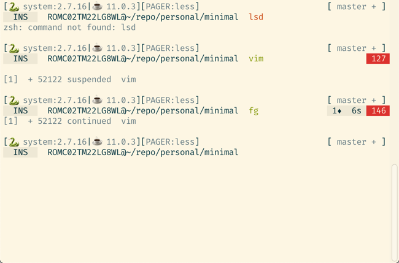

# Minimal Zsh

A minimal asynchronous zsh theme based on fantastic work by [@eendroroy](https://github.com/eendroroy) and [@mafredri](https://github.com/mafredri).

It is optimized for use with [Fira Code](https://github.com/tonsky/FiraCode) and [Solarized Light](https://ethanschoonover.com/solarized/) theme.

## Preview


## Installation 
### Antibody

```
antibody bundle glsorre/minimal
```
### Manual

In your `.zshrc` add
```
source minimal.zsh
```